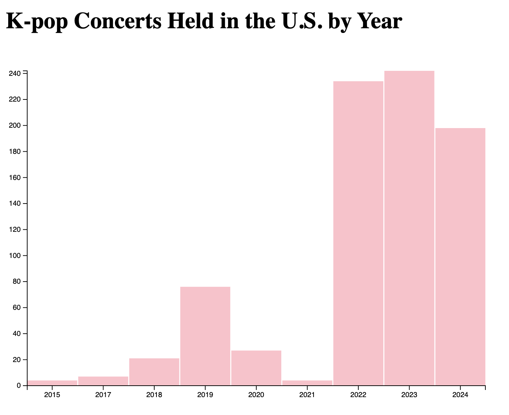

# D3 Homework 1

## Description

This homework assignment is a bar chart visualization created using d3.js. The visualization represents the number of K-pop tours that occurred in the United States over time and highlights the growth of K-pop touring activity over time, with a significant increase after 2021. The chart was created using data loaded from an external CSV file. 

## Visual

    

## Data Source

This dataset was self-compiled using publicly available information from tour announcements, venue websites, ticketing platforms, concert records and Wikipedia under the 'tours.csv' file. It was then simplified using a pivot table to display only the number of concerts held per year in 'tours_by_year.csv'.

## Course & Institution
B Data 497 Advanced Topics: Public Data Investigation
University of Washington Bothell
Professor Nicole Cote