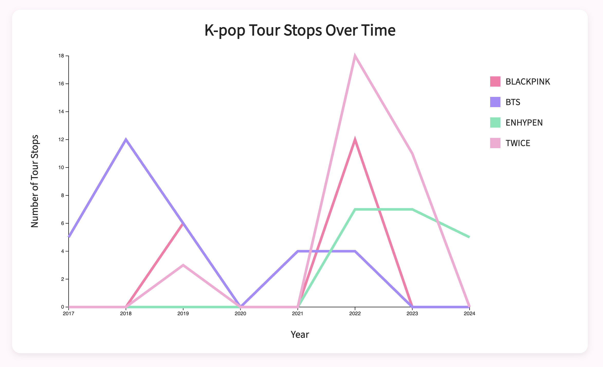

# D3 Homework 2

## Description
This homework assignment is a multi-line chart visualization created using d3.js. The visualization represents the number of K-pop tour stops over time for several K-pop artists including BLACKPINK, BTS, ENHYPEN, and TWICE. The chart highlights changes in touring activity across different years and compares trends between artists using multiple lines, SVG text, scales, axes, and CSS styling. The visualization was created using data loaded from an external CSV file.

## Visual
D3 multi-line chart visualization

## Data Source
This dataset was self-compiled using publicly available information from tour announcements, venue websites, ticketing platforms, concert records and Wikipedia under the `tours.csv` file. It was then simplified using a pivot table to display the number of tour stops per year for selected artists in `tour_counts.csv`.

## Author
Emmy Ngo

## Course & Institution
B Data 497 Advanced Topics: Public Data Investigation  
University of Washington Bothell  
Professor Nicole Cote