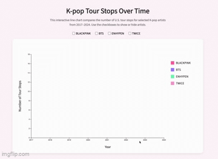

# D3 Homework 3

## Description
This homework assignment is an interactive multi-line chart visualization created using d3.js. The visualization represents the number of K-pop tour stops over time for several K-pop artists including BLACKPINK, BTS, ENHYPEN, and TWICE. The chart includes interaction through HTML checkbox inputs and JavaScript event listeners, allowing users to show or hide artist lines on the chart. Transitions were implemented to animate updates when lines appear or disappear. The visualization was styled using CSS and built using SVG elements, scales, axes, and external CSV data.

## Visual
Interactive D3 multi-line chart visualization

## Interaction
Users can interact with the visualization using checkboxes to toggle artist lines on and off. When a checkbox is selected or deselected, the chart updates with a transition effect that changes whether selected artist’s data is displayed on the chart.

## Data Source
This dataset was self-compiled using publicly available information from tour announcements, venue websites, ticketing platforms, concert records and Wikipedia under the `tours.csv` file. It was then simplified using a pivot table to display the number of tour stops per year for selected artists in `tour_counts.csv`.

## Author
Emmy Ngo

## Course & Institution
B Data 497 Advanced Topics: Public Data Investigation  
University of Washington Bothell  
Professor Nicole Cote