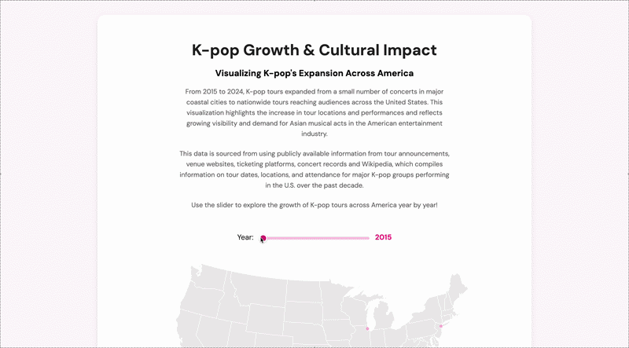

# D3 Homework 4

## Description
This homework assignment is an interactive narrative map visualization created using d3.js. The visualization explores the growth of K-pop touring across the United States from 2015 to 2024 using geographic data plotted on a U.S. map. The project highlights how K-pop tours expanded from a small number of concerts concentrated in major coastal cities to nationwide tours reaching audiences across the country.

The visualization uses cumulative yearly data to demonstrate the increasing visibility and demand for K-pop and Asian musical acts within the American entertainment industry. Users can interact with the project through an HTML range slider that updates the visualization year by year, gradually revealing the spread of tour stops over time. The project also incorporates a dynamic tour counter, interactive tooltips, color encoding by year, and narrative fact cards that provide additional cultural and historical context related to K-pop’s mainstream growth in the United States.

The visualization was styled using CSS and built using SVG elements, geographic projections, transitions, scales, and external CSV data.

## Visual
Interactive D3 narrative map visualization

## Interaction
Users can interact with the visualization using a year slider to explore the growth of K-pop tours across the United States over time. As the slider changes, tour stops accumulate on the map to visually demonstrate the geographic expansion of K-pop touring and increasing audience demand. Hovering over individual tour stops displays additional information including artist name, venue, city, and performance date through interactive tooltips.

## Data Source
This dataset was self-compiled using publicly available information from tour announcements, venue websites, ticketing platforms, concert records, and Wikipedia under the `tours.csv` file. Geographic coordinates were added to map tour locations across the United States from 2015 to 2024.

Additional contextual information and references regarding K-pop industry milestones were sourced from:
- TIME Magazine
- Pitchfork
- Business Insider
- Wikipedia

## Author
Emmy Ngo

## Course & Institution
B Data 497 Advanced Topics: Public Data Investigation  
University of Washington Bothell  
Professor Nicole Cote